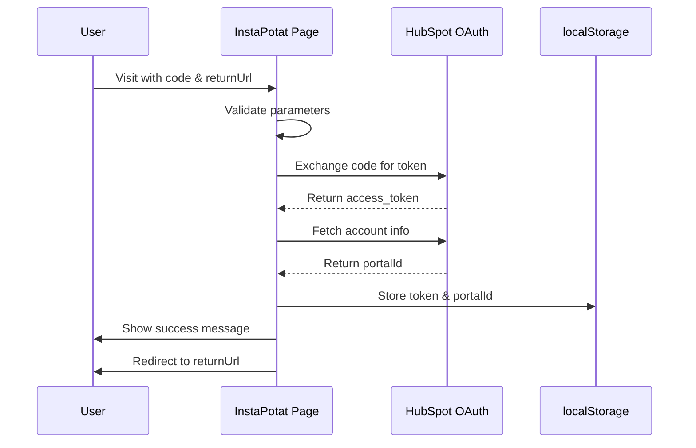

# ⚡ InstaPotat No-Auth OAuth Setup

## Overview

InstaPotat is a simplified OAuth flow designed for HubSpot apps that don't require personal data or user authentication. It provides instant installation without sign-in.

## 🆚 Comparison: InstaPotat vs HappyPotato

| Feature | HappyPotato OAuth | InstaPotat OAuth |
|---------|-------------------|------------------|
| **Route** | `/oauth` | `/insta-potat/no-auth` |
| **Authentication** | ✅ Required (Supabase) | ❌ None |
| **State Validation** | ✅ CSRF protection | ❌ Not needed |
| **Steps** | authorize → finalize | finalize only |
| **Token Storage** | Supabase + localStorage | localStorage only |
| **User Profile** | ✅ Saved to database | ❌ No database |
| **Personal Data** | ✅ User-specific | ❌ None collected |
| **Use Case** | Apps with user accounts | Apps without personal data |

## 🚀 How It Works

### Flow Diagram



### Step-by-Step Process

1. **User clicks install** in HubSpot marketplace
2. **HubSpot redirects** to `/insta-potat/no-auth?code=XXX&returnUrl=YYY`
3. **InstaPotat validates** code and returnUrl parameters
4. **Exchange code** for access token (no auth needed)
5. **Fetch account info** to get portal ID
6. **Store in localStorage**:
   - `instapotat_access_token`
   - `instapotat_portal_id`
7. **Show success** message briefly
8. **Redirect** back to returnUrl

## 📝 URL Parameters

### Required Parameters

- **`code`**: Authorization code from HubSpot OAuth
- **`returnUrl`**: URL to redirect to after installation

### Example URL

```
https://yourdomain.com/insta-potat/no-auth?code=abc123xyz&returnUrl=https://app.hubspot.com/app/12345
```

## 💾 Data Storage

### localStorage Keys

```typescript
// Access token from HubSpot
localStorage.setItem('instapotat_access_token', token);

// Portal ID associated with the installation
localStorage.setItem('instapotat_portal_id', portalId);
```

### Retrieving Stored Data

```typescript
const token = localStorage.getItem('instapotat_access_token');
const portalId = localStorage.getItem('instapotat_portal_id');

console.log('InstaPotat token:', token);
console.log('Portal ID:', portalId);
```

## 🎨 UI/UX Features

### Visual Design
- **Dark blue gradient** background (vs. brown for HappyPotato)
- **Lightning bolt ⚡ + potato 🥔** logo
- **Gold accents** (#FFD700) for "instant" feel
- **Floating lightning/potato** animations

### Status Messages

1. **Initial**: "🥔 Preparing your InstaPotat..."
2. **Exchanging**: "🔄 Exchanging code for access token..."
3. **Fetching**: "📋 Fetching account information..."
4. **Success**: "🎉 InstaPotat installed successfully for Portal [ID]!"
5. **Redirecting**: "🌟 Redirecting you now..."

### Error Messages

- "🚨 Missing authorization code. Installation failed."
- "🚨 Missing return URL. Installation failed."
- "🍠 Installation failed: [error details]"

## 🔒 Security Considerations

### What InstaPotat DOESN'T Have

- ❌ No authentication layer
- ❌ No state parameter validation
- ❌ No CSRF protection
- ❌ No database storage
- ❌ No user profiles

### Why This Is Okay

InstaPotat is designed for apps that:
- Don't handle personal data
- Don't need user-specific storage
- Are "stateless" in nature
- Have minimal security requirements

### What Protection Exists

- ✅ HubSpot OAuth authorization code (one-time use)
- ✅ HTTPS for all requests
- ✅ Code must be exchanged within timeframe
- ✅ Token stored locally (not transmitted)

## 🧪 Testing

### Local Testing

1. **Start dev server**: `npm run dev`
2. **Simulate HubSpot redirect** (you'll need a real OAuth code from HubSpot):
   ```
   http://localhost:5173/insta-potat/no-auth?code=YOUR_CODE&returnUrl=http://localhost:3001/callback
   ```

### What to Check

- ✅ Status messages update correctly
- ✅ Token stored in localStorage
- ✅ Portal ID stored in localStorage
- ✅ Redirects to returnUrl after ~2 seconds
- ✅ Error handling works (try without code/returnUrl)

### Console Output

**Success Flow:**
```
🥔 InstaPotat: Starting no-auth installation
📝 Code: present
🔗 ReturnUrl: https://app.hubspot.com/...
✅ Successfully received access token
✅ Portal ID: 12345678
💾 Token stored in localStorage
🚀 Redirecting to: https://app.hubspot.com/...
```

**Error Flow:**
```
🥔 InstaPotat: Starting no-auth installation
📝 Code: missing
❌ No authorization code provided
```

## 🔧 Configuration

### Environment Variables

Same as HappyPotato OAuth:

```env
VITE_HUBSPOT_CLIENT_ID=your_client_id
VITE_HUBSPOT_CLIENT_SECRET=your_client_secret
VITE_HUBSPOT_REDIRECT_URI=your_redirect_uri
```

### HubSpot App Configuration

In HubSpot's app settings:
1. **Redirect URI**: Set to `/insta-potat/no-auth`
2. **Authentication**: Disable user authentication
3. **Scopes**: Set minimal required scopes
4. **Installation**: Direct install (no auth screen)

## 🎯 Use Cases

### Good for InstaPotat

- ✅ Public data displays
- ✅ Reporting tools (aggregated data)
- ✅ Analytics dashboards
- ✅ Non-personalized features
- ✅ Marketplace listing previews

### NOT Good for InstaPotat

- ❌ Apps with user-specific data
- ❌ Apps requiring authentication
- ❌ Apps handling PII (Personal Identifiable Information)
- ❌ Apps with user profiles
- ❌ Apps needing persistent storage

## 🔄 Token Refresh

**Note**: InstaPotat currently doesn't implement token refresh. Since tokens are stored only in localStorage:

- Token expires based on HubSpot's expiration policy
- User would need to reinstall the app
- Consider implementing refresh token flow for production

### Future Enhancement

```typescript
// Store refresh token
localStorage.setItem('instapotat_refresh_token', refreshToken);

// Implement refresh logic
async function refreshToken() {
  const refreshToken = localStorage.getItem('instapotat_refresh_token');
  // Call HubSpot refresh endpoint
}
```

## 📊 Monitoring & Logging

All actions are logged to console with emojis for easy identification:

- 🥔 General flow messages
- 📝 Parameter validation
- 🔗 URL information
- ✅ Success states
- ❌ Error states
- 💾 Storage operations
- 🚀 Redirects

## 🚨 Error Handling

### Error Types

1. **Missing Code**: Installation cannot proceed
2. **Missing ReturnUrl**: Cannot redirect after install
3. **Token Exchange Failed**: HubSpot API error
4. **No Portal ID**: Account info incomplete
5. **Network Errors**: Connection issues

### User Experience

- Clear error messages with potato emojis
- Status indicator changes from spinning to static
- Error stays visible (no auto-redirect)
- User must restart installation process

## 🔄 Migration from HappyPotato

If you need to migrate an app from authenticated to no-auth:

1. **Remove authentication**: Update HubSpot app settings
2. **Update route**: Change from `/oauth` to `/insta-potat/no-auth`
3. **Remove state params**: No longer needed
4. **Simplify flow**: Skip authorize step
5. **Update storage**: localStorage instead of Supabase

## 📚 API Reference

### Component: `InstaPotatOAuthPage`

**Props**: None (reads from URL params)

**URL Parameters**:
- `code` (required): OAuth authorization code
- `returnUrl` (required): Redirect destination

**localStorage**:
- `instapotat_access_token`: HubSpot API token
- `instapotat_portal_id`: HubSpot portal ID

**Lifecycle**:
1. Mount → `useEffect` triggers
2. `handleInstallation()` runs automatically
3. Success → redirects after 2 seconds
4. Error → displays error message

## 🎨 Customization

### Colors

```css
/* Background gradient */
background: linear-gradient(135deg, #1a1a2e 0%, #16213e 50%, #0f3460 100%);

/* Accent color */
border: 3px solid #FFD700; /* Gold */

/* Status messages */
color: #1a1a2e; /* Dark blue-black */
```

### Timing

```typescript
// Success message delay
setTimeout(() => {
  setStatusMessage('🌟 Redirecting you now...');
  setTimeout(() => {
    window.location.href = returnUrl;
  }, 500);
}, 1500); // Total: 2 seconds
```

### Animations

- **Logo**: Pulse animation (scale 1 → 1.1)
- **Spinner**: Rotate 360° continuously
- **Success**: Bounce-in effect
- **Progress**: Animated bar (0% → 100%)

## 🐛 Troubleshooting

### "Missing authorization code"

- Check URL has `?code=` parameter
- Verify redirect URI matches HubSpot settings
- Ensure code hasn't expired (typically 10 minutes)

### "No access token received"

- Verify CLIENT_ID and CLIENT_SECRET in `.env`
- Check REDIRECT_URI matches exactly
- Review network tab for API errors

### "Installation failed"

- Check browser console for detailed error
- Verify HubSpot OAuth proxy is running
- Test with curl to isolate issue

### Token Not Saving

- Check localStorage isn't disabled
- Verify no browser extensions blocking storage
- Check for private/incognito mode restrictions

