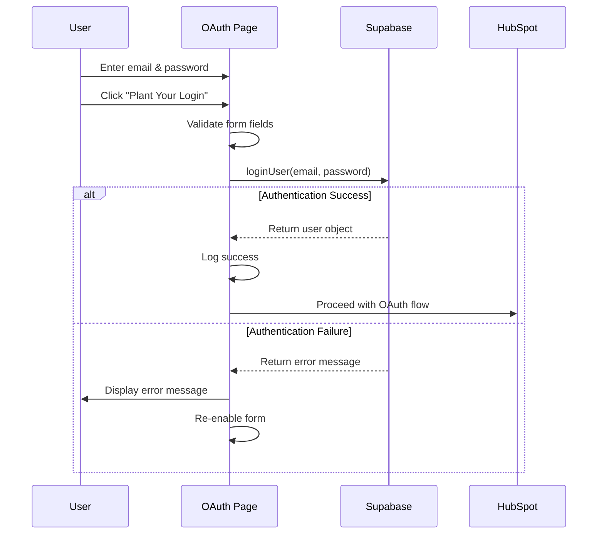

# OAuth Page Supabase Authentication Integration

## Overview

The OAuth page now requires Supabase authentication before proceeding with the HubSpot OAuth flow. This ensures that only authenticated users can connect their HubSpot accounts.

## Changes Made

### 1. Authentication Flow

**Before**: The OAuth page accepted any username/password without validation

**After**: Users must authenticate with Supabase before proceeding with OAuth

### 2. Form Fields Updated

- Changed from "Username" to "Email" (uses Supabase email)
- Password field remains the same
- Both fields are now required and validated
- Email field uses proper email validation
- Password must be at least 6 characters

### 3. Validation & Error Handling

#### Client-Side Validation
- Email and password fields are required
- Password minimum length: 6 characters
- HTML5 validation (required, type="email", minLength)

#### Supabase Authentication
- Calls `loginUser(email, password)` from `/lib/auth`
- Validates credentials against Supabase database
- Returns user object on success or error message on failure

#### Error Display
- Beautiful error messages in potato-themed UI
- Shake animation draws attention to errors
- Errors auto-clear when user retries

### 4. UI Improvements

#### Error Message Styling
```css
.auth-error {
  background: linear-gradient(135deg, #FFE5E5, #FFB3B3);
  color: #8B0000;
  padding: 1rem;
  border-radius: 10px;
  border: 2px solid #FF6B6B;
  animation: shake 0.5s ease-in-out;
}
```

#### Loading States
- "🔐 Authenticating with Supabase..." during auth
- Original loading messages after successful auth
- Button disabled during authentication

## Authentication Flow



## Error Messages

### Authentication Errors
- 🥔 Please enter both email and password!
- 🥔 Password must be at least 6 characters!
- 🍠 Authentication failed: [Supabase error message]
- 🥔 Authentication failed. Please check your credentials.

### OAuth Errors (existing)
- 🥔 Missing returnUrl! Your potato needs a destination to return to!
- 🚨 Finalize Error: Missing authorization code
- 🚨 Security Error: Missing/invalid state parameter
- 🥔 Oops! No returnUrl found. Your potato needs a destination!

## Usage Example

### Step 1: User visits OAuth page
```
http://localhost:5173/oauth?step=authorize&returnUrl=https://app.example.com/callback
```

### Step 2: User enters credentials
- Email: user@example.com
- Password: securepassword123

### Step 3: Form submission
1. Validates email and password are present
2. Validates password length >= 6
3. Calls Supabase `loginUser()`
4. On success: Proceeds with OAuth flow
5. On failure: Shows error, re-enables form

### Step 4: OAuth proceeds (if authenticated)
- State parameter generated (if authorize step)
- Cookies set for security
- Redirects or exchanges tokens as appropriate

## Security Considerations

1. **Email-based authentication**: More secure than username
2. **Supabase validation**: Server-side validation of credentials
3. **No local password storage**: Passwords sent directly to Supabase
4. **Session management**: Handled by Supabase automatically
5. **State parameter**: Still used for CSRF protection in OAuth flow

## Testing

### Valid Login
1. Create a user in Supabase (via /login page or Supabase dashboard)
2. Visit OAuth page with valid returnUrl
3. Enter valid email and password
4. Should proceed with OAuth flow

### Invalid Login
1. Visit OAuth page
2. Enter invalid credentials
3. Should see error message
4. Form should be re-enabled
5. Can retry with correct credentials

### Empty Fields
1. Leave email or password empty
2. HTML5 validation should prevent submission
3. Browser will show "Please fill out this field"

### Short Password
1. Enter password < 6 characters
2. HTML5 validation should prevent submission
3. Browser will show "Please lengthen this text to 6 characters or more"

## Future Enhancements

- [ ] Add "Forgot Password" link
- [ ] Add "Create Account" link
- [ ] Remember email (localStorage)
- [ ] Social auth options (Google, GitHub, etc.)
- [ ] Two-factor authentication
- [ ] Rate limiting for failed attempts
- [ ] Session timeout handling

## Code Structure

### State Variables
```typescript
const [email, setEmail] = useState('');
const [password, setPassword] = useState('');
const [authError, setAuthError] = useState<string | null>(null);
```

### Authentication Logic
```typescript
async function handleSubmit(event: React.FormEvent<HTMLFormElement>) {
  // 1. Prevent default form submission
  // 2. Validate fields
  // 3. Call loginUser()
  // 4. Handle success/failure
  // 5. Proceed with OAuth or show error
}
```

### Error Handling
```typescript
if (loginError) {
  setAuthError(`🍠 Authentication failed: ${loginError}`);
  setButtonDisabled(false);
  setButtonText('Plant Your Login 🌱');
  return;
}
```

## Dependencies

- `loginUser` from `/lib/auth.ts`
- Supabase client (configured in `/lib/supabase.ts`)
- React hooks (useState, useEffect)
- Standard HTML5 form validation

## Browser Compatibility

- Modern browsers (Chrome, Firefox, Safari, Edge)
- HTML5 form validation required
- CSS animations supported
- ES6+ JavaScript features used

