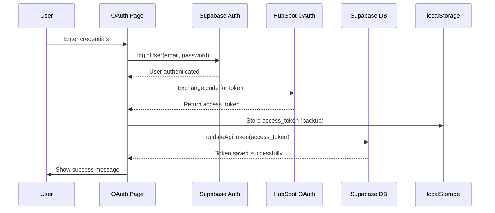

# HubSpot Access Token Storage

## Overview

After a successful OAuth flow, the HubSpot access token is now saved to both localStorage and the Supabase `user_profiles` table for the authenticated user.

## Flow



## Implementation Details

### 1. Token Exchange
After successfully authenticating with Supabase, the OAuth page exchanges the authorization code for an access token:

```typescript
const response = await fetch('https://us-central1-hubspot-oauth-proxy.cloudfunctions.net/exchange_code', {
  method: 'POST',
  headers: { 'Content-Type': 'application/json' },
  body: JSON.stringify({
    code: code,
    client_id: CLIENT_ID,
    client_secret: CLIENT_SECRET,
    redirect_uri: REDIRECT_URI
  })
});

const data = await response.json();
```

### 2. Save to localStorage (Backup)
```typescript
localStorage.setItem('access_token', data.access_token);
```

### 3. Save to Supabase Database
```typescript
const { success, error: saveError } = await updateApiToken(data.access_token);

if (saveError) {
  console.error('❌ Failed to save access token to Supabase:', saveError);
  showError('🍠 Token received but failed to save to your profile. Please try again.');
  return;
}

if (success) {
  console.log('✅ Successfully saved HubSpot access token to Supabase!');
}
```

## Database Schema

The token is stored in the `user_profiles` table:

```sql
CREATE TABLE user_profiles (
  id UUID PRIMARY KEY REFERENCES auth.users(id) ON DELETE CASCADE,
  username TEXT UNIQUE NOT NULL,
  api_token TEXT,  -- HubSpot access token stored here
  created_at TIMESTAMPTZ DEFAULT NOW(),
  updated_at TIMESTAMPTZ DEFAULT NOW()
);
```

## Row Level Security (RLS)

The `user_profiles` table has RLS enabled:

- ✅ Users can read their own profile
- ✅ Users can update their own profile (including api_token)
- ✅ Tokens are protected from other users

## Error Handling

### Token Save Failure
If the token fails to save to Supabase:
- ❌ Shows error message: "🍠 Token received but failed to save to your profile. Please try again."
- ❌ Stops the OAuth flow (doesn't proceed to success screen)
- ✅ Token is still in localStorage as backup

### Authentication Failure
If user is not authenticated:
- `updateApiToken()` returns `{ success: false, error: 'Not authenticated' }`
- This should never happen in practice since OAuth requires login first

## Console Logs

You can monitor the token save process in the browser console:

```
💾 Saving HubSpot access token to Supabase...
✅ Successfully saved HubSpot access token to Supabase!
```

Or on error:
```
❌ Failed to save access token to Supabase: [error message]
```

## Retrieving the Token

### From Supabase
```typescript
import { getCurrentUser } from './lib/auth';

const { user, error } = await getCurrentUser();
if (user) {
  const hubspotToken = user.apiToken;
  // Use the token for HubSpot API calls
}
```

### From localStorage (Fallback)
```typescript
const hubspotToken = localStorage.getItem('access_token');
```

## Security Considerations

1. **Token Storage**: Both localStorage and Supabase database
   - localStorage: Client-side, vulnerable to XSS
   - Supabase: Server-side with RLS protection (more secure)

2. **Token Lifecycle**:
   - Tokens should be refreshed before expiration
   - Old tokens should be invalidated after refresh
   - Future: Implement token refresh flow

3. **Access Control**:
   - Only authenticated users can update their own token
   - Row Level Security prevents access to other users' tokens

## Future Improvements

- [ ] Implement token refresh flow
- [ ] Store token expiration time
- [ ] Auto-refresh tokens before expiration
- [ ] Store refresh_token separately
- [ ] Add token encryption at rest
- [ ] Implement token revocation
- [ ] Add audit log for token updates

## Testing

### Manual Test
1. Visit OAuth page: `/oauth?step=authorize&returnUrl=http://localhost:3001/callback`
2. Enter valid Supabase credentials
3. Complete OAuth flow
4. Check browser console for success message
5. Check Supabase dashboard:
   - Go to Table Editor → user_profiles
   - Find your user
   - Verify `api_token` field is populated

### Verify Token Retrieval
```typescript
// In browser console or ProfilePage
import { getCurrentUser } from './lib/auth';

const { user } = await getCurrentUser();
console.log('HubSpot Token:', user?.apiToken);
```

## API Documentation

### `updateApiToken(apiToken: string)`

Updates the current user's HubSpot access token in Supabase.

**Parameters:**
- `apiToken` (string): The HubSpot access token to save

**Returns:**
```typescript
Promise<{
  success: boolean;
  error: string | null;
}>
```

**Example:**
```typescript
const { success, error } = await updateApiToken('your-token-here');

if (success) {
  console.log('Token saved successfully!');
} else {
  console.error('Failed to save token:', error);
}
```

**Error Cases:**
- User not authenticated: `{ success: false, error: 'Not authenticated' }`
- Database error: `{ success: false, error: '[database error message]' }`
- Success: `{ success: true, error: null }`

